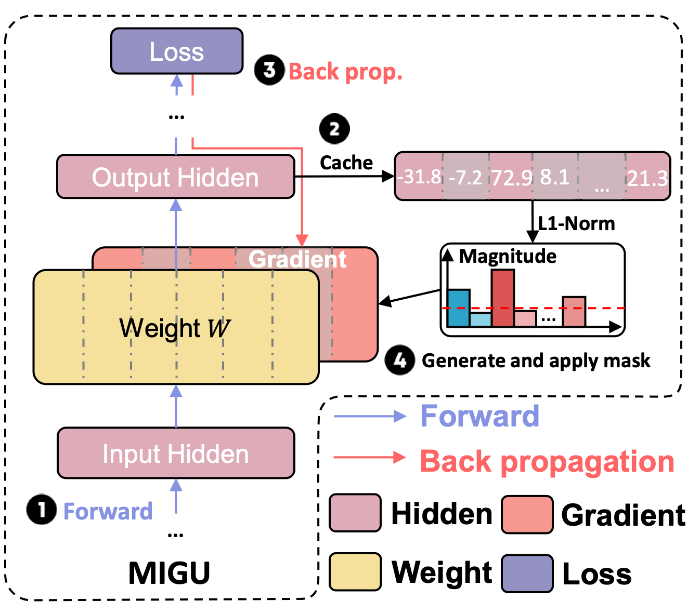

# MIGU
<div align="center">
    
</div>

The official implementation for the paper **Unlocking Continual Learning Abilities in Language Models** [EMNLP 2024 Findings]

<p align="center">
🔔 <a href="https://github.com/wenyudu/MIGU" target="_blank">Code</a> • 📃 <a href="https://arxiv.org/abs/2406.17245" target="_blank">Paper</a><br>
</p>

## Abstract
Language models (LMs) exhibit impressive performance and generalization capabilities. However, LMs struggle with the persistent challenge of catastrophic forgetting, which undermines their long-term sustainability in continual learning (CL). Existing approaches usually address the issue by incorporating old task data or task-wise inductive bias into LMs. However, old data and accurate task information are often unavailable or costly to collect, hindering the availability of current CL approaches for LMs. To address this limitation, we introduce "MIGU" (**M**agnitude-based **G**radient **U**pdating for continual learning), a rehearsal-free and task-label-free method that only updates the model parameters with large magnitudes of output in LMs' linear layers. MIGU is based on our observation that the L1-normalized magnitude distribution of the output in LMs' linear layers is different when the LM models deal with different task data. By imposing this simple constraint on the gradient update process, we can leverage the inherent behaviors of LMs, thereby unlocking their innate CL abilities. Our experiments demonstrate that MIGU is universally applicable to all three LM architectures (T5, RoBERTa, and Llama2), delivering state-of-the-art or on-par performance across continual finetuning and continual pre-training settings on four CL benchmarks. For example, MIGU brings a 15.2% average accuracy improvement over conventional parameter-efficient finetuning baselines in a 15-task CL benchmark. MIGU can also seamlessly integrate with all three existing CL types to further enhance performance.

## Getting Started
```
git clone https://github.com/wenyudu/MIGU
cd MIGU
pip install -r requirements.txt
```
You are also required to download the t5-large model from huggingface, put it to the folder named initial_model.

## Training and Evaluation
For full tuning with T5-large, you can reproduce our experiments of order 1,2,3 by simply running:
```
bash scripts/standard_benchmark_ft.sh
```


## Acknowledge
Our code is based on O-LoRA, licensed under the Apache-2.0 license.
```
@article{wang2023orthogonal,
  title={Orthogonal Subspace Learning for Language Model Continual Learning},
  author={Wang, Xiao and Chen, Tianze and Ge, Qiming and Xia, Han and Bao, Rong and Zheng, Rui and Zhang, Qi and Gui, Tao and Huang, Xuanjing},
  journal={arXiv preprint arXiv:2310.14152},
  year={2023}
}
```
## Citation
```
@misc{du2024unlockingcontinuallearningabilities,
      title={Unlocking Continual Learning Abilities in Language Models}, 
      author={Wenyu Du and Shuang Cheng and Tongxu Luo and Zihan Qiu and Zeyu Huang and Ka Chun Cheung and Reynold Cheng and Jie Fu},
      year={2024},
      eprint={2406.17245},
      archivePrefix={arXiv},
      primaryClass={cs.LG}
      url={https://arxiv.org/abs/2406.17245}, 
}
```
